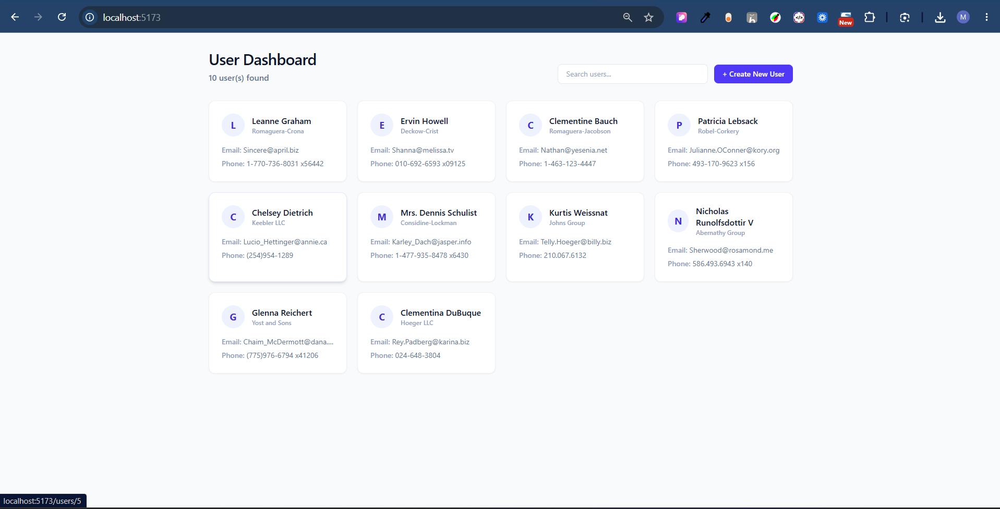
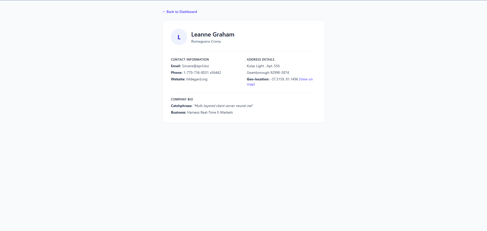

# UserHub - React User Management Dashboard

A modern, responsive user management dashboard built with React, Vite, and Tailwind CSS.

## Features

- **User Dashboard:** View all users in a clean, responsive grid layout.
- **Search & Filter:** Debounced search functionality to instantly filter users by name.
- **User Details:** Dedicated profile page for each user with contact info, company details, and an embedded geo-location map link.
- **Add New Users:** A sleek modal form to easily add new users to the system.

---

## Screenshots

### Main Dashboard


### User Details Page


---

## Getting Started

Follow these steps to set up the project locally:

### 1. Prerequisites
Ensure you have [Node.js](https://nodejs.org/) installed (version 18+ recommended).

### 2. Installation
Clone the repository and install the dependencies:
```bash
npm install
```

### 3. Run the Development Server
Start the Vite development server:
```bash
npm run dev
```

### 4. Open in Browser
Open your browser and navigate to:
```
http://localhost:5173
```

---

## Tech Stack
- **Framework:** React + Vite
- **Styling:** Tailwind CSS
- **Form Handling:** react-hook-form
- **Routing:** react-router-dom
- **Data Fetching:** axios